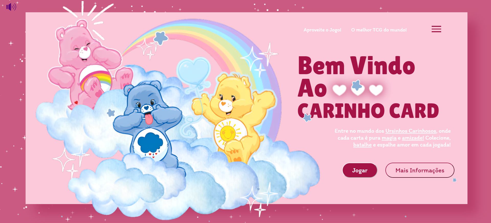

# Carinho-Cards
Projeto CARINHO CARDS desenvolvido apos conhecimento adquirido de JavaScrip ao longo dos semestres.

# Objetivo do Projeto:
O objetivo desse projeto foi desenvolver um jogo de cartas interativo, eu e minha dupla de dev escolhemos fazer no estilo de "Super Trunfo" combinando com elementos de Pokémon, utilizando tecnologias web como HTML CSS e JavaScript. O tema que escolhemos foi "Ursinhos Carinhosos" trazendo um vizual colorido e nostálgico para o jogo alem de garantir uma experiência diferente e divertida.

# Como o jogo funciona
O jogo funciona da seguinte maneira: dois jogadores começam com 3 cartas cada em sua bancada. Uma carta inicial é colocada no centro do campo. Em cada rodada, os jogadores usam uma de suas cartas para enfrentar a carta central. Se um jogador vencer o confronto, ele descarta a carta inicial e marca um ponto. Caso perca, o outro jogador tem a oportunidade de rebater. 

# Observação:
O jogo está responsivo! então você pode jogar no seu celular também!

# participações e links:
  

Participações:
> [Isabelly Dias Baptista](https://github.com/IDBaptista)

Links:
> [Game]()
